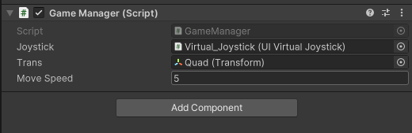
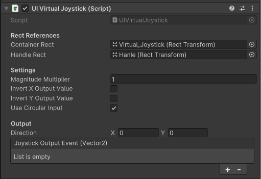

#### GameManager

```csharp
using System.Collections;
using System.Collections.Generic;
using UnityEngine;

public class GameManager : MonoBehaviour
{
    public UIVirtualJoystick joystick;
    public Transform trans;
    public float moveSpeed = 1f;

    // Start is called before the first frame update
    void Start() { }

    // Update is called once per frame
    void Update()
    {
        Vector2 joystickDirection = joystick.direction;

        Vector3 movement = new Vector2(joystickDirection.x, joystickDirection.y);

        trans.position += movement * moveSpeed * Time.deltaTime;
    }
}

```

#### UIVirtualJoystick

```csharp
using UnityEngine;
using UnityEngine.Events;
using UnityEngine.EventSystems;

public class UIVirtualJoystick : MonoBehaviour, IPointerDownHandler, IDragHandler, IPointerUpHandler
{
    [System.Serializable]
    public class Event : UnityEvent<Vector2> { }

    [Header("Rect References")]
    public RectTransform containerRect;
    public RectTransform handleRect;

    [Header("Settings")]
    public float magnitudeMultiplier = 1f;
    public bool invertXOutputValue;
    public bool invertYOutputValue;
    public bool useCircularInput = true;

    [Header("Output")]
    public Vector2 direction;
    public Event joystickOutputEvent;

    private float joystickRadius;
    private bool isPointerDown = false; // 新增：标记是否在有效点击范围内

    void Start()
    {
        joystickRadius = containerRect.sizeDelta.x * 0.5f;

        UpdateHandleRectPosition(Vector2.zero);
    }

    public void OnPointerDown(PointerEventData eventData)
    {
        if (useCircularInput)
        {
            isPointerDown = false;
            RectTransformUtility.ScreenPointToLocalPointInRectangle(
                containerRect,
                eventData.position,
                eventData.pressEventCamera,
                out Vector2 localPoint
            );

            if (localPoint.magnitude > joystickRadius)
            {
                return;
            }
        }

        isPointerDown = true;

        OnDrag(eventData);
    }

    public void OnDrag(PointerEventData eventData)
    {
        // 如果不在有效点击范围内，则忽略
        if (!isPointerDown)
            return;

        RectTransformUtility.ScreenPointToLocalPointInRectangle(
            containerRect,
            eventData.position,
            eventData.pressEventCamera,
            out Vector2 position
        );

        position = position / joystickRadius;

        Vector2 clampedPosition = Vector2.ClampMagnitude(position, 1f);

        Vector2 outputPosition = ApplyInversionFilter(clampedPosition);

        direction = outputPosition * magnitudeMultiplier;
        joystickOutputEvent.Invoke(direction);

        if (handleRect)
        {
            UpdateHandleRectPosition(clampedPosition * joystickRadius);
        }
    }

    public void OnPointerUp(PointerEventData eventData)
    {
        direction = Vector2.zero;
        joystickOutputEvent.Invoke(Vector2.zero);

        if (handleRect)
        {
            UpdateHandleRectPosition(Vector2.zero);
        }
    }

    private void UpdateHandleRectPosition(Vector2 newPosition)
    {
        handleRect.anchoredPosition = newPosition;
    }

    private Vector2 ApplyInversionFilter(Vector2 position)
    {
        if (invertXOutputValue)
        {
            position.x = -position.x;
        }

        if (invertYOutputValue)
        {
            position.y = -position.y;
        }

        return position;
    }
}

```
